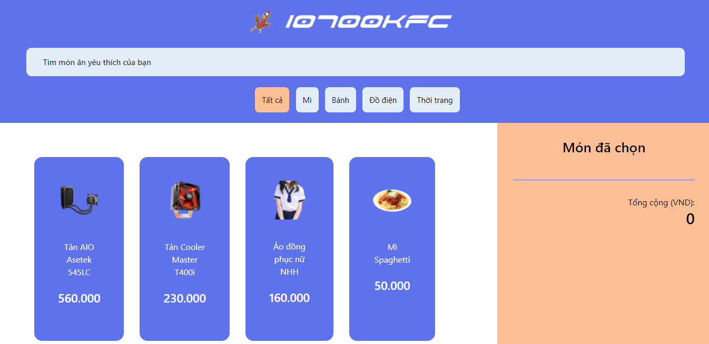
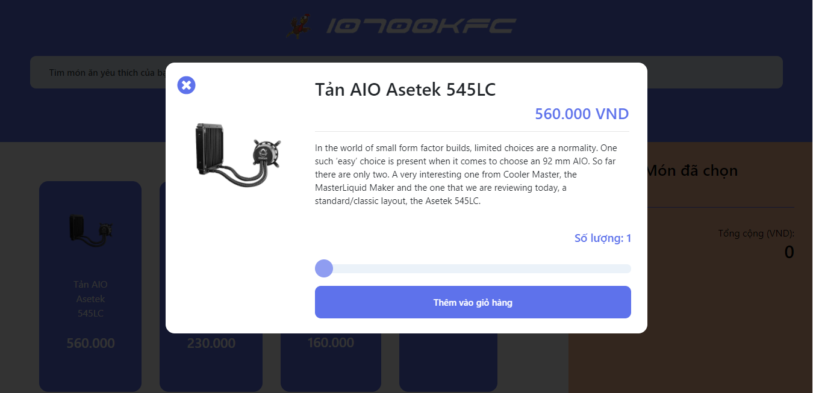

# 10700KFC

For a demo run, visit [this link](https://giathyex.github.io/10700KFC/).

Demo run with kitchen, [click here](https://giathyex.github.io/10700KFC/kitchen/kitchen.html).

For some stupid security reasons, when you decide to run the HTML file locally via browser, you have to use [Visual Studio Code](https://code.visualstudio.com/) with [Live Preview](https://marketplace.visualstudio.com/items?itemName=ms-vscode.live-server) extension.

Or you can install live-server by the following command:
```
npm install -g live-server
```

Then at the directory holding the index.html file, type in cmd/terminal:
```
live-server
```
to view the result.

The JS code has been obfuscated to prevent stupid vandals from copying and destroying. To view to original source code, visit the [original_source_code](https://github.com/giathyex/10700KFC/tree/main/original_source_code) folder.

Preview pictures:

<p align="center">
  <br>
  
  <br>
  <br>
  
  <br>
  <br>
  
  <br>
  <br>
  
  <br>
  <br>
  
  <br>
</p>

Mobile version is also available:

<p align="center">
  <br>
  
  <br>
</p>

Kitchen interface receive real-time update from database of customers orders

<p align="center">
  <br>
  
  <br>
  <br>
  
  <br>
</p>

Mobile version of kitchen interface: 

<p align="center">
  <br>
  
  <br>
</p>

No framework, no complicated DB. Just pure HTML, JS + JQuery, Firestore.

**Note:** 

The real source code is in the ***original_source_code*** folder.

Link of demo on [youtube](https://youtu.be/X1Puo5LXK74)

The username and password for kitchen: temp 123456.