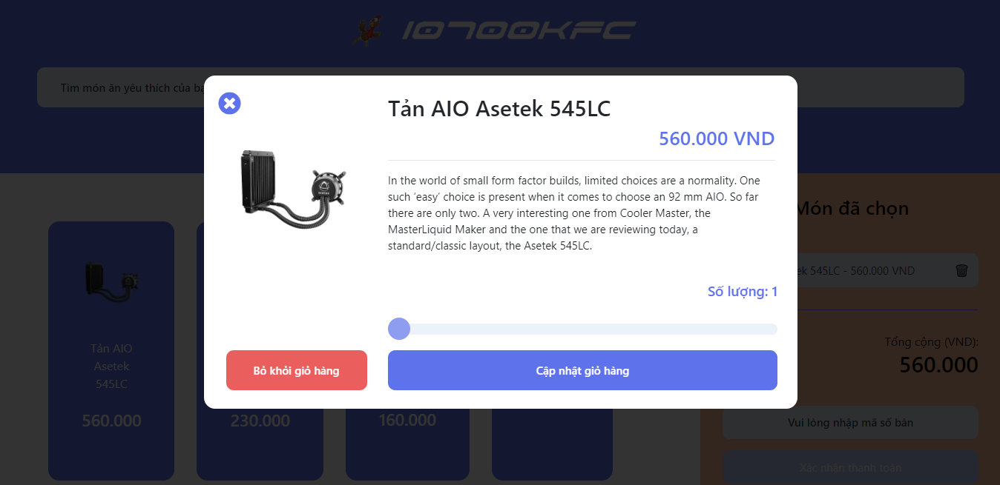

# 10700KFC

For a demo run, visit [this link](https://giathyex.github.io/10700KFC/).

When you decide to run locally via browser, you have to use [Visual Studio Code](https://code.visualstudio.com/) with [Live Preview](https://marketplace.visualstudio.com/items?itemName=ms-vscode.live-server) extension.

Or you can install live-server by the following command:
```
npm install -g live-server
```

Then at the directory holding the index.html file, type in cmd/terminal:
```
live-server
```
to view the result.

<p align="center">
  <br>
  
  <br>
  <br>
  
  <br>
  <br>
  
  <br>
  <br>
  
  <br>
  <br>
  
  <br>
</p>

Mobile interface is also available:

<p align="center">
  <br>
  
  <br>
  <br>
  
  <br>
  <br>
  
  <br>
  <br>
  
  <br>
</p>

No framework, no complicated DB. Just pure HTML, JS + JQuery, Firestore.
